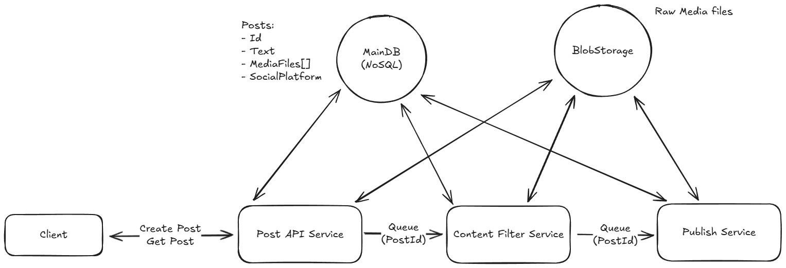

# Post Pipeline

An experimental micro‑service pipeline that moderates and publishes user‑generated content to social platforms.

## Table of Contents

* [Architecture](#architecture)
* [Tech Stack](#tech-stack)
* [Development](#development)
  * [Prerequisites](#prerequisites)
  * [Setup](#setup)
  * [Running the Services](#running-the-services)
  * [Local Environment Dashboards](#local-environment-dashboards)
  * [API Collection](#api-collection)
  * [Clean‑up](#clean-up)
* [License](#license)

## Architecture



The repository models a **Post publishing pipeline** consisting of three asynchronous services communicating over **Kafka** queues:

| Service            | Responsibility                                                                 |
| ------------------ | ------------------------------------------------------------------------------ |
| **Post API**       | Exposes REST endpoints to create posts and query their status.                 |
| **Content Filter** | Moderates both the text and media of a post (can include AI + human review).   |
| **Publisher**      | Publishes an approved post to the target social platform via its official API. |

A **Post** contains:

* `text` - the post body
* `mediaFiles[]` - references to media stored in **MinIO/S3**
* `socialPlatform` - destination platform (e.g. *x*, *threads*)

Posts are stored in **MongoDB**; media files are stored in **MinIO** (S3‑compatible object storage).

Because moderation can be time‑consuming, all inter‑service traffic is *event‑driven* via Kafka, enabling horizontal scaling and keeping the API responsive.

## Tech Stack

* **TypeScript** - primary language for all packages
* **Turborepo** - monorepo orchestration
* **Gemini API** - post content moderation
* **Kafka** - message broker between services
* **MongoDB** - primary database
* **MinIO** - local S3 simulation for media assets
* **Docker Compose** - spins up the entire environment locally

## Development

### Prerequisites

* **Node 22** and **pnpm**
* **Docker** (tested with Docker 27.4)

### Setup

```bash
# 1 - Install dependencies
pnpm install

# 2 - Pull container images for local services
pnpm env:pull
```

> **API Keys**
> Copy every `.env.example` to `.env` and supply your `GEMINI_API_KEY` inside `apps/content-filter-service`.

### Running the Services

```bash
pnpm dev # Starts all services + watchers
```

### Local Environment Dashboards

| Service         | URL                                              |
| --------------- | ------------------------------------------------ |
| Kafka UI        | [http://localhost:8080/](http://localhost:8080/) |
| MongoDB Express | [http://localhost:8081/](http://localhost:8081/) |
| MinIO Console   | [http://localhost:9001/](http://localhost:9001/) |

### Postman

Import the Post API collection from [`./postman/PostAPI.postman_collection.json`](./postman/PostAPI.postman_collection.json).

### Clean‑up

```bash
pnpm env:cleanup # Removes all Docker Compose resources
```
